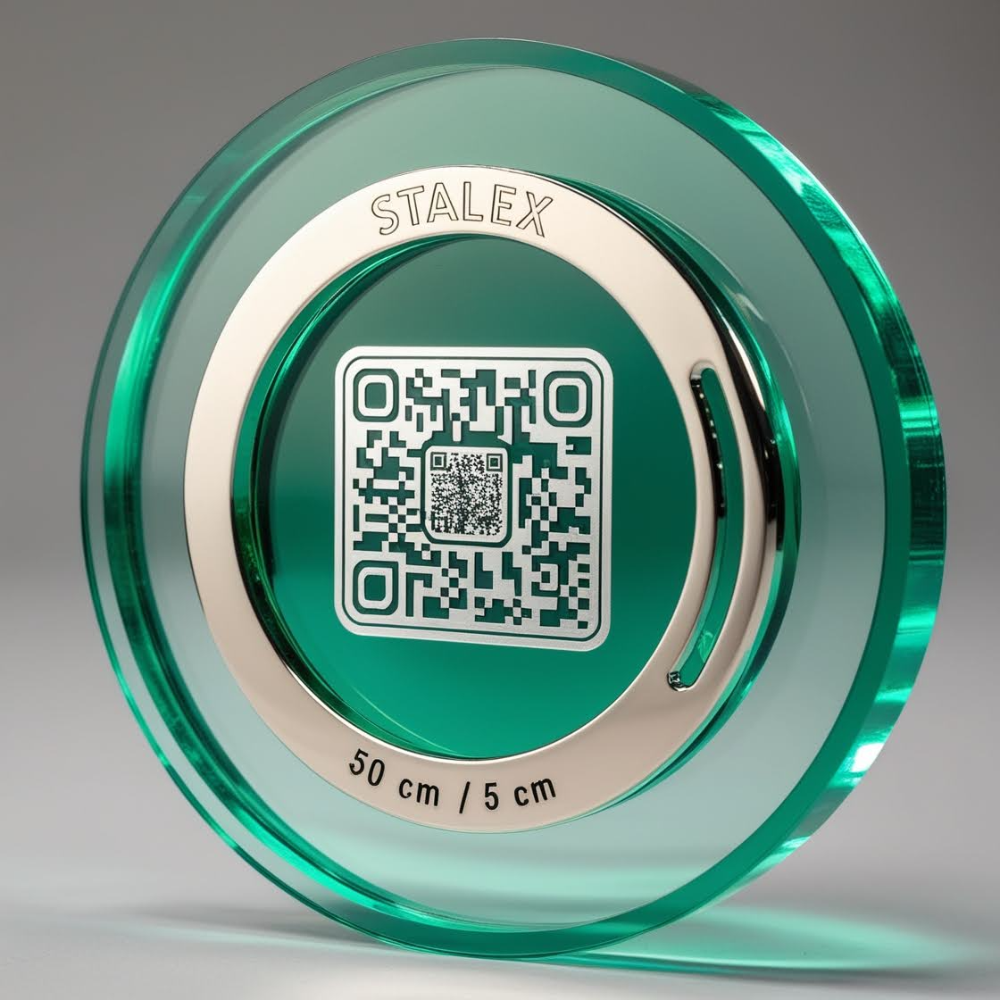

# lex
DAO LEx, a primeira IA Legislativa e vereador de São Paulo, para o Brasil e mundo.

### Projeto: DAO da LEX - **Stalex Governance**



# DAO da LEX - **Stalex Governance**

Bem-vindo à versão **1.1** do projeto **DAO da LEX**! Agora, com a integração do **Stalex** no financiamento de projetos estratégicos para a cidade de São Paulo, estamos prontos para transformar a governança urbana e a sustentabilidade. Este projeto visa criar uma plataforma descentralizada onde os cidadãos podem participar ativamente da tomada de decisões e do financiamento de iniciativas como **100% Solar**, **100% Economia Circular**, **100% Fazendas Verticais Solares**, **100% Mobilidade Elétrica Gratuita**, **100% Bio Bairros**, **100% Inclusão da População em Situação de Rua**, **100% Valorização dos Catadores** e **100% Renda Per Capita de US$ 100K**.

---

## Objetivo

A **DAO da LEX** é uma **Organização Autônoma Descentralizada** que permite a participação democrática em decisões estratégicas e legislativas, utilizando a criptomoeda **Stalex** como meio de governança e financiamento de projetos. Os membros da DAO podem:

1. **Propor e votar em iniciativas legislativas e de financiamento**.
2. **Contribuir como validadores** para a manutenção da rede.
3. **Receber recompensas** em tokens Stalex e NFTs por sua participação.

---

## Funcionalidades Principais

1. **Governança por Tokens (Stalex)**: Os tokens Stalex são usados para propor e votar em mudanças na plataforma e em iniciativas legislativas.
2. **Plataforma de Validação**: Membros podem atuar como validadores da rede, garantindo a segurança e a descentralização.
3. **Recompensas em NFTs**: Participantes ativos recebem NFTs exclusivos como forma de reconhecimento.
4. **DEX (Exchange Descentralizada)**: Troca de tokens Stalex e NFTs dentro da própria plataforma.

---

## Tecnologias Utilizadas

- **Blockchain**: Ethereum (ou Solana) para contratos inteligentes.
- **Contratos Inteligentes**: Escritos em **Solidity** (Ethereum) ou **Rust** (Solana).
- **Frontend**: **React.js** ou **Vue.js**.
- **Web3.js**: Para conexão com a blockchain.
- **IPFS**: Armazenamento descentralizado para metadados de NFTs.
- **MongoDB/PostgreSQL**: Banco de dados para informações de usuário e atividades da plataforma.

---

## Estrutura de Pastas Atualizada

```bash
dao-lex/
│
├── contracts/               # Contratos Inteligentes (Solidity ou Rust)
│   ├── governance/          # Contratos de governança (propostas e votação)
│   ├── staking/             # Contratos de staking e recompensas
│   └── dex/                 # Contratos da exchange descentralizada
│
├── frontend/                # Interface de usuário
│   ├── public/              # Arquivos públicos (HTML, imagens)
│   └── src/                 # Código-fonte do frontend (React ou Vue)
│       ├── components/      # Componentes reutilizáveis
│       ├── pages/           # Páginas principais da aplicação
│       └── utils/           # Funções auxiliares
│
├── scripts/                 # Scripts de deploy e interação com contratos
│   └── deploy.js            # Script de deploy dos contratos inteligentes
│
├── tests/                   # Testes automatizados
│   ├── unit/                # Testes unitários dos contratos
│   ├── integration/         # Testes de integração
│   └── e2e/                 # Testes de ponta a ponta
│
├── docs/                    # Documentação do projeto
│   └── whitepaper.md        # Whitepaper da DAO da LEX
│
├── .env                     # Variáveis de ambiente
├── package.json             # Dependências do projeto
├── hardhat.config.js        # Configuração do Hardhat (ou Truffle)
└── README.md                # Documentação principal
```

---

## Automatizando a Criação de Arquivos e Pastas

Para automatizar a criação da estrutura de arquivos e pastas, você pode usar o seguinte script **bash**. Ele criará todas as pastas e arquivos necessários para o projeto.

### Script de Criação Automática

```bash
#!/bin/bash

# Criando diretórios principais
mkdir -p dao-lex/contracts/governance
mkdir -p dao-lex/contracts/staking
mkdir -p dao-lex/contracts/dex
mkdir -p dao-lex/frontend/public
mkdir -p dao-lex/frontend/src/components
mkdir -p dao-lex/frontend/src/pages
mkdir -p dao-lex/frontend/src/utils
mkdir -p dao-lex/scripts
mkdir -p dao-lex/tests/unit
mkdir -p dao-lex/tests/integration
mkdir -p dao-lex/tests/e2e
mkdir -p dao-lex/docs

# Criando arquivos principais
touch dao-lex/.env
touch dao-lex/package.json
touch dao-lex/hardhat.config.js
touch dao-lex/README.md
touch dao-lex/docs/whitepaper.md
touch dao-lex/scripts/deploy.js

# Criando arquivos de exemplo para contratos
touch dao-lex/contracts/governance/Governance.sol
touch dao-lex/contracts/staking/Staking.sol
touch dao-lex/contracts/dex/DEX.sol

# Criando arquivos de exemplo para frontend
touch dao-lex/frontend/src/components/Header.js
touch dao-lex/frontend/src/pages/Home.js
touch dao-lex/frontend/src/utils/web3.js

# Criando arquivos de exemplo para testes
touch dao-lex/tests/unit/governance.test.js
touch dao-lex/tests/integration/staking.test.js
touch dao-lex/tests/e2e/dex.test.js

echo "Estrutura de pastas e arquivos criada com sucesso!"
```

Esse script pode ser executado no terminal para criar automaticamente toda a estrutura do projeto.

---

## Design Pattern e UML

Para garantir que o projeto siga as melhores práticas de design, vamos utilizar o **Design Pattern de Facade** para simplificar a interação entre o frontend e os contratos inteligentes, e o **Pattern de Observer** para monitorar eventos de governança e recompensas. Abaixo estão os diagramas UML para ilustrar a arquitetura do projeto.

### 1. **Diagrama UML de Governança (Facade Pattern)**

```plaintext
+-----------------------------------+
|          GovernanceFacade         |
+-----------------------------------+
| + createProposal()                |
| + voteProposal()                  |
| + getProposals()                  |
+-----------------------------------+
           /|\           /|\
            |             |
+----------------+   +----------------+
|  Governance.sol |   |  Staking.sol   |
+----------------+   +----------------+
```

### 2. **Diagrama UML de Validação e Recompensas (Observer Pattern)**

```plaintext
+-----------------------------------+
|          ValidatorObserver        |
+-----------------------------------+
| + notifyValidator()               |
| + updateRewards()                 |
+-----------------------------------+
           /|\           /|\
            |             |
+----------------+   +----------------+
|  Validator.sol  |   |  Rewards.sol   |
+----------------+   +----------------+
```

---

## Testes Automatizados

Os testes são essenciais para garantir a segurança e a funcionalidade da DAO da LEX. Utilizamos **Hardhat** (ou **Truffle**) para testar os contratos inteligentes e **Jest** para testar o frontend.

### Exemplo de Teste Unitário

```javascript
const { expect } = require("chai");

describe("Governance Contract", function () {
  it("Deve permitir a criação de uma proposta", async function () {
    const [owner] = await ethers.getSigners();
    const Governance = await ethers.getContractFactory("Governance");
    const governance = await Governance.deploy();
    
    await governance.createProposal("Proposta de Teste", "Descrição da Proposta");
    const proposal = await governance.getProposal(0);
    
    expect(proposal.title).to.equal("Proposta de Teste");
  });
});
```

### Exemplo de Teste de Integração

```javascript
describe("Staking and Rewards Integration", function () {
  it("Deve permitir o staking e distribuir recompensas", async function () {
    const [owner, user] = await ethers.getSigners();
    const Staking = await ethers.getContractFactory("Staking");
    const staking = await Staking.deploy();
    
    await staking.stake({ from: user.address, value: ethers.utils.parseEther("1") });
    const rewards = await staking.calculateRewards(user.address);
    
    expect(rewards).to.be.above(0);
  });
});
```

---

## Conclusão

Com a nova estrutura de **DAO da LEX** e a integração do **Stalex** no financiamento de projetos estratégicos para São Paulo, estamos prontos para transformar a cidade em um modelo global de inovação, sustentabilidade e inclusão. A estrutura descentralizada permitirá que os cidadãos participem ativamente da governança e do financiamento de iniciativas como **100% Solar**, **100% Economia Circular** e **100% Mobilidade Elétrica Gratuita**.

Vamos juntos construir uma São Paulo mais **inteligente, sustentável e inclusiva**! 🚀💚

"Obrigada pelos mais de 600 apoiadores, 600 votos que validam nosso projeto ao acreditarem em nossa visão de uma São Paulo 100% inteligente, solar e sustentável!"
